# Manual de Instalação — Downdetector Monitor (Zabbix + Grafana)

> **Nota:** este MD é o rascunho textual original. A **fonte oficial do PDF** agora é `docs/manual-instalacao.html` (layout SG/JR.TEC.BR) — edite o HTML e rode `python docs/build_pdf.py`. Ver `docs/README.md`.

**Pipeline:** Downdetector BR → Coletor (Playwright/patchright) → `zabbix_sender` → Zabbix → Grafana NOC (TV 40")

| | |
|---|---|
| **Versão do documento** | 1.1 (2026-09-30) |
| **Aplicável a** | `ZABBIX-DOWNDETECTOR-V2` — branch `main` (dashboards v1.1.0, instalador v1.1.2 com stack) |
| **Sistemas suportados** | Debian 11/12/13, Ubuntu 22.04/24.04, RHEL/Rocky/Alma/Oracle 8/9 |
| **Ambiente de referência** | VM Debian 13 (trixie) — Zabbix 7.4.15, Grafana 13.2.3, Python 3.13 |
| **Instalador** | `install.sh` (turnkey: valida, provisiona, semeia e verifica) |

> **Resumo em uma linha:** com Zabbix Server e Grafana **já instalados e rodando**, basta copiar o projeto para o servidor e executar `sudo ./install.sh` — o instalador instala só o que é necessário ao Downdetector, configura, semeia os dados e verifica o resultado (código 1 se falhar).

---

## Sumário

1. [Como o sistema funciona](#1-como-o-sistema-funciona)
2. [Pré-requisitos](#2-pré-requisitos)
3. [O que o instalador faz](#3-o-que-o-instalador-faz)
4. [Passo a passo da instalação](#4-passo-a-passo-da-instalação)
5. [Verificação pós-instalação](#5-verificação-pós-instalação)
6. [TV / Kiosk (opcional)](#6-tv--kiosk-opcional)
7. [Anexo A — Instalação sem perguntas (UNATTENDED)](#7-anexo-a--instalação-sem-perguntas-unattended)
8. [Anexo B — Atualizar o projeto depois (deploy)](#8-anexo-b--atualizar-o-projeto-depois-deploy)
9. [Anexo C — Operação do dia a dia](#9-anexo-c--operação-do-dia-a-dia)
10. [Anexo D — Solução de problemas (FAQ)](#10-anexo-d--solução-de-problemas-faq)
11. [Anexo E — Referência rápida](#11-anexo-e--referência-rápida)

---

## 1. Como o sistema funciona

O monitor **não mede a rede** — ele mede o que o **Downdetector BR** reporta publicamente sobre cada serviço. O fluxo tem 4 elos:

```
┌──────────────────┐   zabbix_sender    ┌─────────────┐   query    ┌──────────────────┐
│  Coletor Python  │ ─────────────────► │   Zabbix    │ ─────────► │     Grafana      │
│ (Playwright +    │  trapper + LLD     │  (Server +  │            │  (dashboards NOC │
│  Chromium/Xvfb)  │  a cada 5 min      │   Frontend) │            │  na TV em kiosk) │
└──────────────────┘                    └─────────────┘            └──────────────────┘
```

- **Coletor** (`downdetector_collector.py`): abre a homepage do Downdetector BR num Chromium real (sob Xvfb, com patchright para passar no Cloudflare), extrai o status dos **42 serviços** e envia ao Zabbix por `zabbix_sender`.
- **Zabbix**: host `Downdetector` com 85 itens criados por **LLD** (42 `Status`, 42 `Status Text`, 1 heartbeat). O heartbeat dispara alerta se a coleta parar por 15 min.
- **Grafana**: dois dashboards provisionados automaticamente — **"Downdetector NOC - User"** (`downdetector-noc-1`) e **"Downdetector NOC - Wallboard"** (`downdetector-tv-1`).
- **Cron**: `*/5` executa a coleta (`/etc/cron.d/downdetector-zabbix`).

**Códigos de status:** `0` = OK · `1` = Instável · `2` = Crítico · `-1` = Sem dados (coleta falhou — nunca é tratado como OK).

---

## 2. Pré-requisitos

O instalador **não instala** Zabbix nem Grafana — eles devem estar funcionando **antes** de começar.

### 2.1 Hardware e SO

| Item | Mínimo recomendado |
|---|---|
| CPU | 2 vCPU (4 recomendado — o Chromium do coletor é pesado) |
| RAM | 4 GB (8 GB recomendado — a stack completa roda banco e web no mesmo host) |
| Disco | 10 GB livres |
| SO | Debian 11/12/13 ou Ubuntu 22.04/24.04 (ou família RHEL 8/9) |
| Acesso | Internet (apt, PyPI, Chromium, `repo.zabbix.com`/`apt.grafana.com`) e conta com **sudo/root** |

### 2.2 Serviços que já devem estar rodando

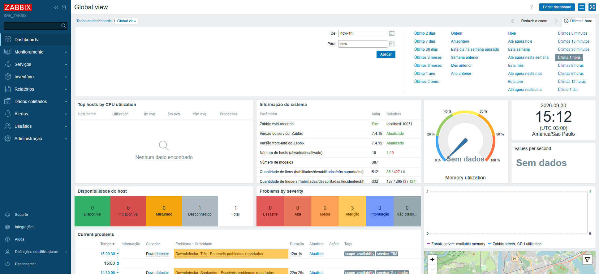

*Frontend do Zabbix na VM de referência: "Zabbix está rodando: Sim", versões 7.4.15 e host Downdetector monitorado. É este estado que o manual assume antes de começar.*

Verifique no servidor antes de iniciar:

```bash
systemctl is-active grafana-server zabbix-server
# resposta esperada (duas linhas):  active  active
```

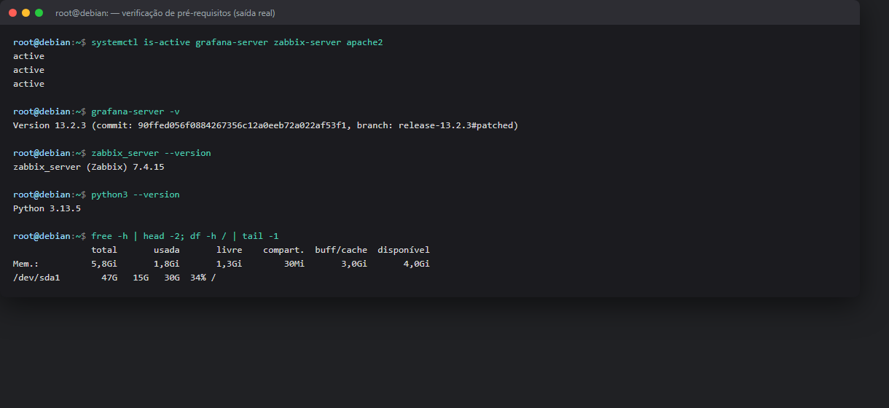

*Saída real da VM de referência: serviços ativos, versões e recursos.*

### 2.3 Endpoints e credenciais que você vai precisar

| O quê | Padrão | Observação |
|---|---|---|
| URL da API do Zabbix | `http://127.0.0.1/zabbix` | Precisa aceitar login via API (`api_jsonrpc.php`) |
| Usuário/senha do Zabbix | `Admin` / (a sua) | Conta com permissão de configurar templates/hosts |
| URL do Grafana | `http://127.0.0.1:3000` | |
| Usuário/senha do Grafana | `admin` / (a sua) | Conta **admin** (provisiona datasource e dashboards) |
| Acesso SSH ao servidor | — | Para copiar os arquivos e rodar o instalador |

> **Dica:** se o Grafana usa `admin` com senha padrão, ele força a troca no primeiro login — troque antes de rodar o instalador, e use a senha nova nas perguntas dele.

---

## 3. O que o instalador faz

O `install.sh` executa **13 etapas** e só termina após verificar tudo (pendências **acumulam**; `exit 1` se algo falhar):

| # | Etapa | O que acontece |
|---|---|---|
| 1 | Dependências do sistema | Instala (via apt/dnf) `python3-venv`, `zabbix-sender`, `xvfb`, bibliotecas do Chromium etc. |
| 2 | Configuração | Pergunta diretório, valida **login no Zabbix e no Grafana** (3 tentativas), perguntas de cron/kiosk |
| 3 | Estrutura | Cria `/opt/downdetector-zabbix`, `logs/`, `state/`, `screenshots/` |
| 4 | Cópia | Copia coletor, template, config, logos para o diretório (e normaliza finais de linha CRLF→LF) |
| 5 | Python | Cria `venv`, instala dependências e o **Chromium** (Playwright/patchright) |
| 6 | Wrapper | Gera `run_collector.sh` (venv + `xvfb-run`) |
| 7 | Plugins Grafana | Garante `gapit-htmlgraphics-panel` e `alexanderzobnin-zabbix-app` (com `--homepath` — no Grafana 13 o CLI falha sem ele) |
| 8 | Provisioning Grafana | Datasource Zabbix (UID `PA67C5EADE9207728`, `cacheTTL 5m`), **2 dashboards**, 51 ícones em `/usr/share/grafana/public/img/downdetector/`, drop-in `disable_sanitize_html` |
| 9 | Zabbix | Importa o template **"Downdetector Monitor"** (LLD) e cria/atualiza o host `Downdetector` |
| 10 | Cron | Agenda a coleta a cada 5 min (`/etc/cron.d/downdetector-zabbix`) |
| 11 | Kiosk (opcional) | Baixa `grafana-kiosk`, cria autostart e habilita acesso anônimo para a TV |
| 12 | Reinicia o Grafana | Reinicia uma única vez (plugins/drop-ins/provisioning), esperando o serviço voltar |
| 13 | Verificação | 10 checks (Zabbix, Grafana, dashboards, ícones, venv, cron) — pendências **acumulam** e o código final é 1 |

---

## 4. Passo a passo da instalação

### 4.1 Obter o projeto no servidor

**Opção A — clonando o repositório (recomendada)**, direto no servidor:

```bash
git clone https://github.com/welissonjunior/ZABBIX-DOWNDETECTOR-V02.git /root/dd-src
cd /root/dd-src
```

> O `.gitattributes` do repo garante finais de linha LF (nada quebra no Linux). Para atualizar depois: `git pull` + `sudo ./install.sh` de novo.

**Opção B — copiar do Windows** (PowerShell, com PuTTY), a partir da pasta do repositório:

```powershell
$pw  = "SUA_SENHA_SSH"; $srv = "root@IP_DO_SERVIDOR"
# cria a pasta de destino e copia o projeto (código + logos; os dashboards são gerados na instalação)
& "C:\Program Files\PuTTY\plink.exe" -ssh $srv -pw $pw -batch "mkdir -p /root/dd-src"
& "C:\Program Files\PuTTY\pscp.exe" -pw $pw -batch -r *.py *.json *.yaml *.sh *.txt *.service logos $srv:/root/dd-src/
```

> O instalador copia os arquivos do diretório onde **ele está** (`SCRIPT_DIR`) para `/opt/downdetector-zabbix`. Por isso o passo a passo roda de `/root/dd-src`.

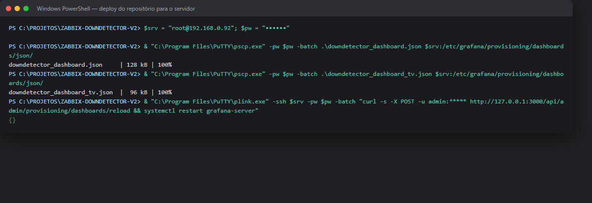

*Exemplo real de envio dos arquivos com pscp (PowerShell + PuTTY).*

### 4.2 Rodar o instalador (modo interativo — recomendado)

No servidor, dentro da pasta do projeto:

```bash
cd /root/dd-src          # pasta onde você copiou o projeto
sudo ./install.sh
```

O instalador começa com o banner e valida o sistema operacional e as dependências:

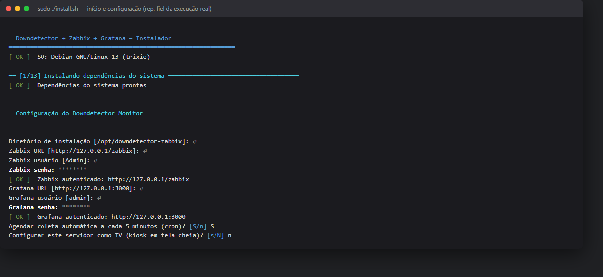

**Perguntas que ele faz** (ENTER aceita o padrão em `[colchetes]`; senhas não aparecem ao digitar):

| Pergunta | Resposta do exemplo |
|---|---|
| `Diretório de instalação` | ENTER (aceita `/opt/downdetector-zabbix`) |
| `Zabbix URL` | ENTER (`http://127.0.0.1/zabbix`) |
| `Zabbix usuário` | ENTER (`Admin`) |
| `Zabbix senha` | senha do usuário da API do Zabbix |
| `Grafana URL` | ENTER (`http://127.0.0.1:3000`) |
| `Grafana usuário` | ENTER (`admin`) |
| `Grafana senha` | senha admin do Grafana |
| `Agendar coleta automática a cada 5 minutos (cron)? [S/n]` | **S** |
| `Configurar este servidor como TV (kiosk em tela cheia)? [s/N]` | `n` aqui; configure depois na [seção 6](#6-tv--kiosk-opcional) se for TV |

> Se a senha estiver errada, ele avisa e pede de novo (até 3 tentativas). Não prossegue com credencial inválida.

### 4.3 Etapas automáticas

A partir daí ele executa as etapas 3 a 12 sem intervenção:

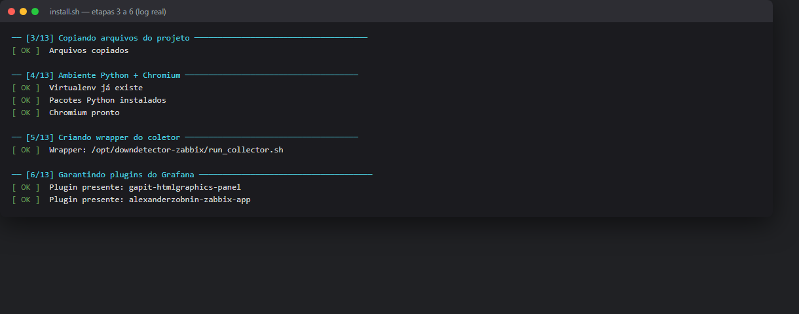

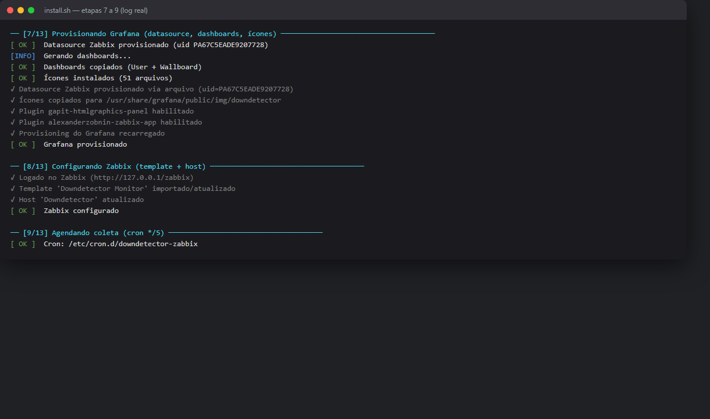

> **Nota:** as mensagens `ℹ ... sem permissão para habilitar via API` são informativas — o provisioning **por arquivo** recarrega sozinho quando o Grafana reinicia na etapa 12.

Durante a **etapa 12 (semeadura)** o coletor abre o Chromium sob Xvfb e enfrenta o Cloudflare — pode levar 1–2 minutos por passada. Duas passadas são executadas: a 1ª cria os itens via LLD; após 20 s a 2ª envia os valores.

### 4.4 Verificação final e resumo

Se tudo deu certo, a etapa 13 mostra os **10 checks** e o resumo com as URLs:

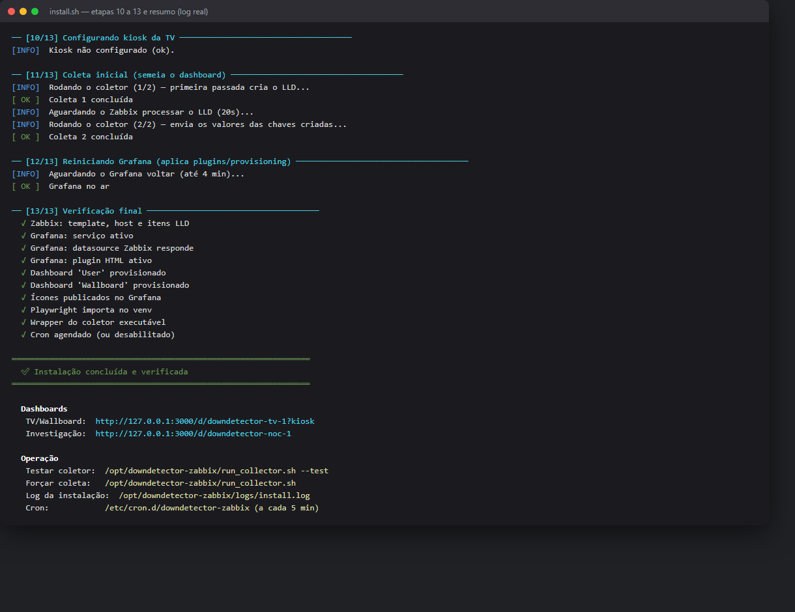

Guarde as duas URLs do resumo — são os dashboards prontos. Em caso de falha, o instalador termina com código 1 e aponta o log: `/opt/downdetector-zabbix/logs/install.log`.

---

## 5. Verificação pós-instalação

### 5.1 Grafana — login

Abra `http://IP_DO_SERVIDOR:3000` e entre com o admin:

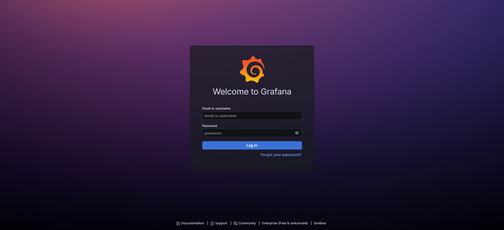

### 5.2 Dashboard Wallboard (TV)

`http://IP_DO_SERVIDOR:3000/d/downdetector-tv-1?kiosk` — tela cheia para a TV. No exemplo, 3 problemas ativos (gov.br, Santander e TIM) com o veredito no topo e os 42 serviços em chips por categoria:

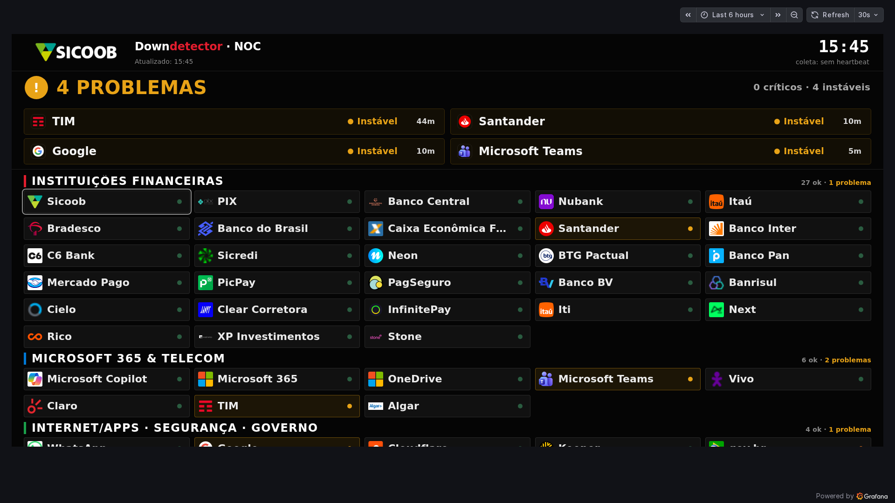

### 5.3 Dashboard User

`http://IP_DO_SERVIDOR:3000/d/downdetector-noc-1?kiosk` — em tela cheia, os 42 cards com sparkline e KPIs no topo (0 ≥ 1h · 4 instáveis · 37 OK · 42 total):

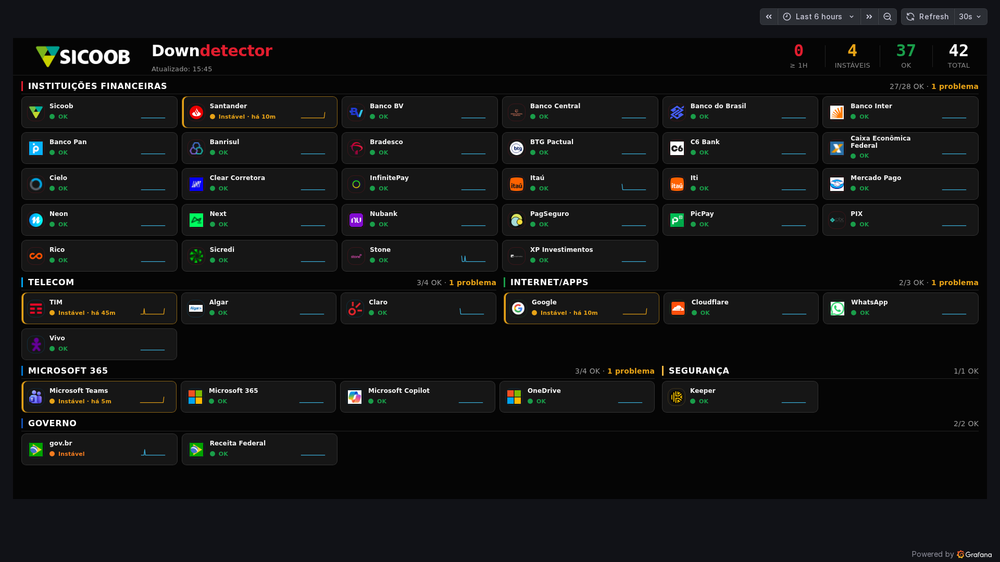

> **Intervalo de tempo:** o dashboard usa `now-6h` por padrão — **não troque**, o cálculo de "desde quando" depende disso.

### 5.4 Zabbix — host e dados chegando

No frontend do Zabbix: **Monitoramento → Hosts** — o host `Downdetector` deve aparecer **Ativo**, com 85 itens e coleta há menos de 5 min:

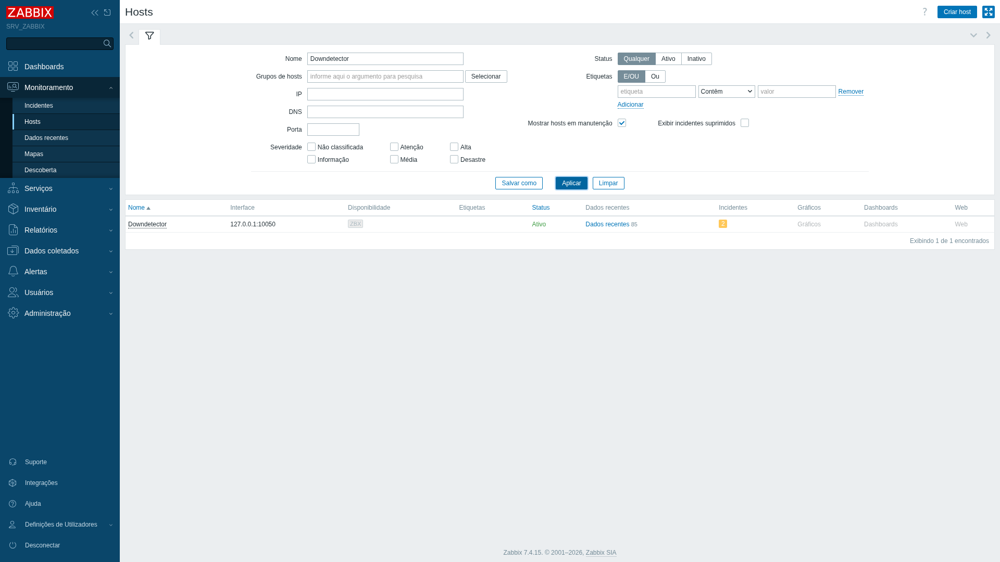

Em **Monitoramento → Dados recentes**, filtre pelo host `Downdetector`: cada serviço deve ter `Status` = `Sem problemas (0)` (ou instável/crítico) e `Status Text` com a descrição:

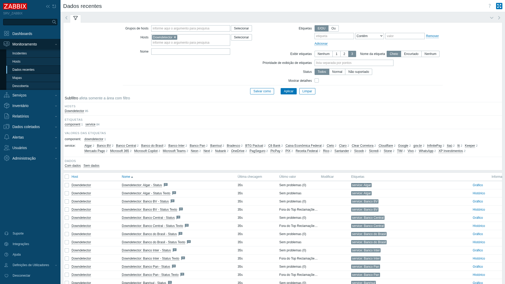

No servidor, o log do coletor confirma o envio (`processed: 85; failed: 0`):

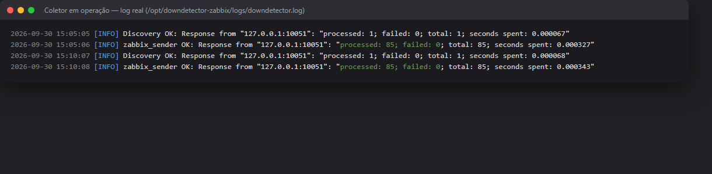

> **Serviços novos não aparecem no dashboard?** O plugin do Grafana cacheia nomes de métricas (`cacheTTL` já vem `5m` no provisionamento). Espere ~5 min ou reinicie: `systemctl restart grafana-server`.

---

## 6. TV / Kiosk (opcional)

Se respondeu **n** na pergunta do kiosk, dá para configurar depois — rode o instalador de novo (é seguro; ele reaproveita o que já existe) e responda `S`, ou siga a mão:

1. **Autostart na TV** (máquina com desktop ligada à TV):
   ```bash
   sudo /opt/downdetector-zabbix/run_kiosk.sh      # teste imediato
   ```
   O `install.sh`, quando o kiosk é aceito, cria `/etc/xdg/autostart/downdetector-kiosk.desktop` (abre sozinho no boot) e baixa o `grafana-kiosk` para `/usr/local/bin`.

2. **TV sem login** — o instalador cria o drop-in systemd que libera acesso anônimo (Viewer):
   ```bash
   systemctl cat grafana-server | grep ANONYMOUS
   # GF_AUTH_ANONYMOUS_ENABLED=true
   # GF_AUTH_ANONYMOUS_ORG_ROLE=Viewer
   ```

3. **Dashboard da TV** — por padrão o kiosk abre o **Wallboard** (`downdetector-tv-1`). Para apontar para o dashboard User:
   ```bash
   KIOSK_DASHBOARD_UID=downdetector-noc-1 /opt/downdetector-zabbix/run_kiosk.sh
   ```

> A TV abre o dashboard em modo kiosk (sem menus). Se aparecer uma faixa preta embaixo, é o chrome do Grafana/kiosk — o conteúdo usa a altura real do painel (~1870×886 em muitos aparelhos).

---

## 7. Anexo A — Instalação sem perguntas (UNATTENDED)

Para automação/Ansible (exatamente o fluxo usado para validar este manual na VM de teste):

```bash
sudo UNATTENDED=1 ./install.sh \
  --zabbix-url http://127.0.0.1/zabbix \
  --zabbix-user Admin --zabbix-pass 'SENHA_ZABBIX' \
  --grafana-url http://127.0.0.1:3000 \
  --grafana-user admin --grafana-pass 'SENHA_GRAFANA'
```

Flags úteis: `--no-seed` (não semeia), `--no-kiosk`, `--no-cron`, `--install-dir DIR`, `-y` (sim para opcionais). Variáveis de ambiente equivalentes: `ZABBIX_URL/ZABBIX_USER/ZABBIX_PASS`, `GRAFANA_URL/GRAFANA_USER/GRAFANA_PASS`, `SKIP_ZABBIX=1`, `SKIP_GRAFANA=1`.

> Em pipe/SSH **sem TTY** o instalador entra em modo não-interativo automaticamente (usa os defaults + env).

---

## 8. Anexo B — Atualizar o projeto depois (deploy)

Alterou `config.json`, dashboards ou o coletor? O ciclo de deploy a partir do Windows:

```powershell
$pw  = "SUA_SENHA_SSH"; $srv = "root@IP_DO_SERVIDOR"
# 1) Regenera os dashboards a partir do builder (local):
python build_dashboard.py
# 2) Envia os arquivos alterados:
& "C:\Program Files\PuTTY\pscp.exe" -pw $pw -batch .\downdetector_dashboard.json    $srv:/etc/grafana/provisioning/dashboards/json/
& "C:\Program Files\PuTTY\pscp.exe" -pw $pw -batch .\downdetector_dashboard_tv.json $srv:/etc/grafana/provisioning/dashboards/json/
& "C:\Program Files\PuTTY\pscp.exe" -pw $pw -batch .\config.json                    $srv:/opt/downdetector-zabbix/config.json
& "C:\Program Files\PuTTY\pscp.exe" -pw $pw -batch .\logos\*.png                    $srv:/usr/share/grafana/public/img/downdetector/
# 3) Recarrega o Grafana (reload + restart — o restart é obrigatório p/ painel HTML):
& "C:\Program Files\PuTTY\plink.exe" -ssh $srv -pw $pw -batch "curl -s -X POST -u admin:SENHA_GRAFANA http://127.0.0.1:3000/api/admin/provisioning/dashboards/reload && systemctl restart grafana-server"
```

**Adicionou serviços no `config.json`?** Envie o config, espere 10–15 s (LLD cria os itens) e **envie os valores de novo** (a 1ª passada do coletor após o LLD costuma falhar para as chaves novas — o cron resolve em até 5 min).

---

## 9. Anexo C — Operação do dia a dia

| Tarefa | Comando |
|---|---|
| Testar o coletor (1 ciclo, sem enviar) | `/opt/downdetector-zabbix/run_collector.sh --test` |
| Forçar uma coleta agora | `/opt/downdetector-zabbix/run_collector.sh` |
| Ver log da coleta | `tail -f /opt/downdetector-zabbix/logs/downdetector.log` |
| Ver log do cron | `tail -f /opt/downdetector-zabbix/logs/cron.log` |
| Reexecutar o instalador (seguro) | `sudo ./install.sh` |
| Reiniciar o Grafana | `systemctl restart grafana-server` |
| Abrir o painel na TV | `http://SERVIDOR:3000/d/downdetector-tv-1?kiosk` |
| Investigar um serviço | `http://SERVIDOR:3000/d/downdetector-noc-1` |

**Entendendo os estados no dashboard:** amarelo = problema há menos de 1 h (status 1); laranja = crítico recente (status 2); **vermelho = problema há 1 h ou mais**; cinza/“Sem dados” = coleta falhou para aquele serviço (status −1). A ordenação sempre põe o **Sicoob primeiro**, depois o problema mais antigo.

---

## 10. Anexo D — Solução de problemas (FAQ)

**1) Tudo aparece "Sem dados" (−1) de uma vez.**
A coleta falhou por completo (ex.: Cloudflare bloqueou). Confira em `logs/downdetector.log`; rode `run_collector.sh --test`. O coletor é desenhado para **nunca fingir OK** — falha total vira `−1` e dispara incidente INFO no Zabbix. Causas clássicas: patchright ausente, contexto persistente (`state/pw-profile`) apagado, ou flags de WebGL `--enable-unsafe-swiftshader --use-angle=swiftshader` removidas do wrapper.

**2) Painel do Grafana em branco / mensagem de plugin desabilitado.**
O Grafana 11+ pode **auto-desabilitar plugins** após upgrade. Vá em **Administration → Plugins and data → Plugins** e habilite `Business...`/`gapit-htmlgraphics-panel` e `alexanderzobnin-zabbix-app` (o `setup.py` tenta reabilitar via API, mas sem credencial válida é manual mesmo). Depois reinicie o Grafana.

**3) Painel HTML não renderiza (vazio).**
O painel injeta HTML/JS — exige `disable_sanitize_html`. O instalador cria o drop-in `GF_PLUGINS_DISABLE_SANITIZE_HTML=true` automaticamente; verifique com `systemctl cat grafana-server | grep SANITIZE`.

**4) Serviço novo não aparece no dashboard.**
Cache de métricas do plugin Zabbix (provisionado com `cacheTTL: 5m`). Aguarde 5 min ou `systemctl restart grafana-server`. Lembre: após criar serviços, o Zabbix precisa de 2 ciclos de coleta (LLD + envio).

**5) A instalação falhou no meio. O que faço?**
Rode `sudo ./install.sh` de novo — todas as etapas são idempotentes (recriam/reutilizam). Veja `logs/install.log` para a etapa exata.

**6) Copiei os arquivos do Windows e o install.sh dá erro de sintaxe (`\r`).**
O instalador normaliza CRLF→LF na cópia; se editar arquivos direto no servidor, mantenha LF (`dos2unix arquivo`).

**7) A TV mostra "dados desatualizados".**
O wallboard fica âmbar quando o heartbeat passa de 10 min. Confira o cron (`cat /etc/cron.d/downdetector-zabbix`) e o log do coletor.

**8) Render anônimo mostra shell vazio nesta instância.**
Nesta versão do Grafana 13 o render **anônimo** de dashboards mostra o shell vazio (comportamento observado na VM de referência). Logue-se como admin para ver os painéis; a TV usa o kiosk autenticado/anon do `grafana-kiosk`.

---

## 11. Anexo E — Referência rápida

| Item | Valor |
|---|---|
| Diretório de instalação | `/opt/downdetector-zabbix` |
| Instalador | `install.sh` (interativo) / `UNATTENDED=1` |
| Log da instalação | `logs/install.log` |
| Coletor | `run_collector.sh` (cron `*/5` → `/etc/cron.d/downdetector-zabbix`) |
| Log do coletor | `logs/downdetector.log` · cron: `logs/cron.log` |
| Host Zabbix | `Downdetector` (85 itens: 42 status + 42 status.text + heartbeat) |
| Template Zabbix | `Downdetector Monitor` (LLD) |
| Datasource Grafana | `Zabbix` — UID `PA67C5EADE9207728`, `cacheTTL 5m` |
| Dashboards | `downdetector-noc-1` (User) · `downdetector-tv-1` (Wallboard/TV) || Ícones | `/usr/share/grafana/public/img/downdetector/` (fallback: letra) |
| Kiosk | `run_kiosk.sh` (abre o Wallboard; override `KIOSK_DASHBOARD_UID`) |
| Config de serviços | `/opt/downdetector-zabbix/config.json` (42 serviços, 6 categorias) |

---

*Manual gerado do repositório `ZABBIX-DOWNDETECTOR-V2`. Screenshots capturados na VM de teste (Debian 13, Zabbix 7.4.15, Grafana 13.2.3) em 30/09/2026; prints de terminal reproduzem fielmente a saída da instalação validada (13/13 etapas, 10/10 checks). Para regenerar o PDF: `python docs/build_pdf.py`.*
